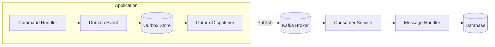
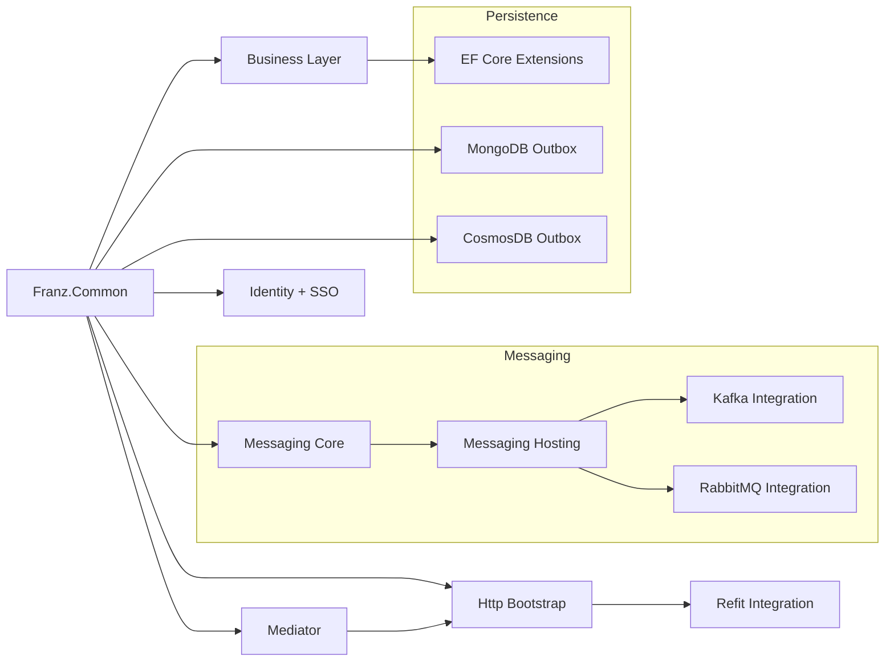

<p align="center">
  
</p>

<h1 align="center">Franz.Common</h1>
<p align="center"><b>Deterministic Architecture for Event-Driven .NET Microservices</b></p>

<p align="center">
  
  
  
  
  
  
  
  
  
</p>

---

# 📘 Overview

**Franz.Common** is the foundation of the **Franz Framework**, a modular, deterministic architecture layer for **building event-driven microservices in .NET 10**.

It eliminates boilerplate, enforces architectural correctness, and provides **DDD, CQRS, messaging, multi-tenancy, resilience, observability, and identity** capabilities—designed for **scalable, long-lived enterprise systems**.

Franz is **Kafka-first**, but also supports **RabbitMQ, Azure Service Bus, MongoDB, CosmosDB, SQL**, and more.

> **Spring Boot for .NET — but deterministic, clean, and transparent.**

---

# 🎯 Why Franz?

Franz was created to bring **predictability, maintainability, and governance** to distributed .NET systems:

- Reduces **80%+** of architectural boilerplate.
- Enforces **structural correctness** at build time.
- Provides **consistent architecture** across microservices.
- Offers **first-class resilience**, **observability**, and **messaging** patterns.
- Minimizes cognitive load through **unified abstractions**.
- Designed for **enterprise requirements** (multi-tenancy, identity, auditability).

---

# 📦 Subpackages

Franz follows a **"batteries-included but modular"** philosophy.

### **Core**
- `Franz.Common` → Core primitives, serialization, DI, functional utilities.

### **Domain & Application**
- `Franz.Common.Business` → DDD aggregates, domain events, pipelines.
- `Franz.Common.Mediator` → Lightweight CQRS mediator with pipelines.

### **Infrastructure**
- `Franz.Common.EntityFramework` → Auditing, soft deletes, domain event dispatching.
- `Franz.Common.MongoDB` → Mongo outbox/inbox.
- `Franz.Common.AzureCosmosDB` → Cosmos outbox/inbox.

### **Messaging**
- `Franz.Common.Messaging` → Messaging contracts, envelopes, options.
- `Franz.Common.Messaging.Hosting` → Hosted async listeners.
- `Franz.Common.Messaging.Kafka`
- `Franz.Common.Messaging.RabbitMQ`

### **HTTP**
- `Franz.Common.Http.Bootstrap`
- `Franz.Common.Http.Refit`
- `Franz.Common.Http.Identity`
- `Franz.Common.Http.Messaging`

### **Identity**
- `Franz.Common.Identity`
- `Franz.Common.SSO` → Keycloak, OIDC, SAML2, WS-Fed integrations.

---

# 🔐 Security Principles

Franz enforces strict, deterministic security patterns:

- Mandatory **CorrelationId**, **TraceId**, and **TenantId** propagation.
- Deterministic error filters (no sensitive data leakage).
- Centralized **authentication & claims enrichment pipelines**.
- Optional strict mode:
  - no unregistered controllers  
  - no unregistered message handlers  
  - validation-first execution  
- Standardized identity flows across **OIDC, SAML2, Keycloak, WS-Fed**.

These principles make Franz suitable for **regulated environments**, including public institutions and financial sectors.

---

# 🌐 Architecture Overview

```mermaid
flowchart TD

subgraph API Layer
    A[HTTP Request] --> B[Franz.Http Pipeline]
    B --> C[Correlation + Validation + Error Handling]
    C --> D[Controller / Minimal API]
end

subgraph Application Layer
    D --> E[Franz.Mediator]
    E --> F[Command / Query Handlers]
    F --> G[Domain Logic]
end

subgraph Infrastructure Layer
    G --> H[(Database)]
    G --> I[[Kafka Producer]]
    G --> J[[RabbitMQ Producer]]
end

subgraph Messaging Layer
    I --> K[[Kafka Broker]]
    J --> L[[RabbitMQ Broker]]

    K --> M[[Kafka Consumer]]
    L --> N[[Rabbit Consumer]]

    M --> E
    N --> E
end
````

---

# 🔄 Runtime Request Lifecycle

```mermaid
sequenceDiagram
    participant Client
    participant API as Franz.Http
    participant Mediator as Franz.Mediator
    participant Handler
    participant Infra as DB / Messaging

    Client->>API: HTTP Request
    API->>API: Correlation + Validation + Error Filter
    API->>Mediator: Dispatch(Request)
    Mediator->>Handler: Execute Handler
    Handler->>Infra: Query DB / Publish Event
    Infra-->>Handler: Response / Ack
    Handler-->>Mediator: Result
    Mediator-->>API: Standardized Response
    API-->>Client: HTTP 200 / 400 / 500
```

---

# 📨 Messaging Flow (Kafka + Outbox)



---

# 🗺️ Franz Ecosystem Map



---

# 🏛️ Architecture Enforcement (Franz Tribunal)

Franz includes an optional **architecture test suite** based on ArchUnitNET:

* Enforces **layer boundaries** (Domain → Application → Infrastructure).
* Forbids **circular dependencies**.
* Enforces **immutable DTOs**.
* Validates naming conventions:

  * Commands, Queries, Events
  * Handlers
  * Controllers
* Ensures no domain leakage into infrastructure and vice-versa.
* Ensures messaging boundaries are respected.

This makes Franz suitable for **large organizations**, where maintaining architectural discipline is critical.

---

# 🚀 Getting Started

### Install the core package:

```bash
dotnet add package Franz.Common --version 1.6.20
```

Messaging example:

```bash
dotnet add package Franz.Common.Messaging.Kafka
```

---

# 💡 Key Features

### ✔ DDD/CQRS First-Class

Entities, value objects, aggregates, events.

### ✔ Mediator with Pipelines

Logging, validation, telemetry, resilience, transactions.

### ✔ Messaging First

Outbox/inbox, retries, DLQ, correlation propagation.

### ✔ Observability

Serilog, OpenTelemetry, structured logs.

### ✔ Multi-tenancy

Tenant resolution across HTTP, messaging, pipelines.

### ✔ Polyglot Persistence

SQL, MongoDB, CosmosDB with unified abstractions.

---

# 🛠️ Build & Test

```bash
git clone https://github.com/bestacio89/Franz.Common.git
cd Franz.Common
dotnet build
dotnet test
```

Kafka integration tests:

```bash
docker-compose up -d
dotnet test --filter Category=Integration
```

---

## **Version 1.6.20 — .NET 10 Modernization Release**

### 🚀 Platform & Runtime

* Updated **all Franz components** to target **.NET 10.0**
* Improved build, packaging, and hosting alignment for .NET 10
* Stabilized end-to-end CI/CD pipelines for .NET 10 on Azure DevOps

### 🗄 Database Providers

* Modernized DB dependencies:

  * SQL Server
  * PostgreSQL
  * MariaDB / Pomelo
  * MySQL
  * MongoDB
  * Azure CosmosDB
* **Removed Oracle EF provider**

  * Due to Oracle’s EFCore provider consistently lagging **2+ major .NET versions**
  * Incompatible with .NET 9/10
  * Not suitable for microservices or cloud-native pipelines

### 📦 Messaging Layer (Kafka, RabbitMQ)

* **RabbitMQ reworked for 1.6.20**:

  * Fully aligned with .NET 10
  * Updated RabbitMQ client to latest stable
  * Realigned abstractions to match Kafka conventions
  * Improved DI shape for hosted listeners
  * Unified outbox hosting across brokers
* Kafka hosting already fully modernized (no changes required)

**📡 Franz.Common.Grpc — v1.6.20**
Modernized gRPC Pipeline for Distributed .NET Microservices

* Franz.Common.Grpc v1.6.20 introduces a complete, production-grade gRPC pipeline aligned with the Franz ecosystem:
  * Full canonical behavior chain (Validation → Tenant → Auth → Logging → Metrics → Exceptions)
  * Client & Server behavior providers with ordered, cached pipelines
  * Unified GrpcCallContext abstraction
  * Named service routing through FranzGrpcClientOptions.Services
  * FranzGrpcClientFactory for channel creation + metadata injection
  * Pure core — no ASP.NET Core dependencies
  * No-op default implementations for effortless setup
  * **.NET 10 modernization compliance**

### 🧰 Templates & Tooling

* Updated all templates (API, Messaging, Infrastructure) to .NET 10 defaults
* Improved starter configuration for logging, OTEL, mediator pipelines, and messaging
* Updated example code, diagrams, and documentation across the ecosystem

### 🔍 Architecture & Documentation

* Introduced clearer **compatibility matrix** for supported databases and runtimes
* Documentation rewritten to reflect the new .NET 10 ecosystem
* Added improved usage examples and deployment guides

---

Full changelog in `changelog.md`.

---


# 🛣️ Roadmap

* Microsoft Azure Event Bus integration
* Extended Cosmos/Mongo projection & TTL helpers
* AWS/GCP multi-cloud samples
* Distributed cache providers (Redis, Memcached)
* Advanced Saga orchestration helpers (optional package)

---

# 🏢 Enterprise Adoption & Support

Franz is maintained with enterprise environments in mind.

For support, consulting, integration guidance, or architectural reviews,
please contact the maintainer.

---

# 🤝 Contributing

Pull requests welcome — internal contributors preferred.
All PRs must include **tests**, **documentation**, and comply with the **Franz Tribunal** architecture rules.

---

# 📜 License

MIT License.

