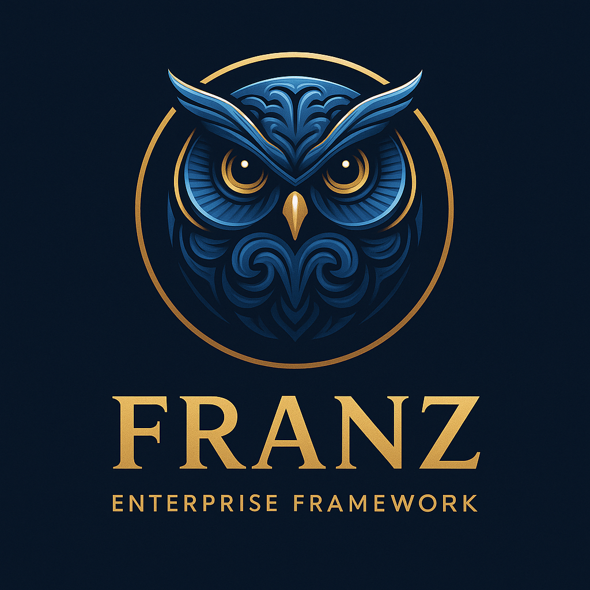
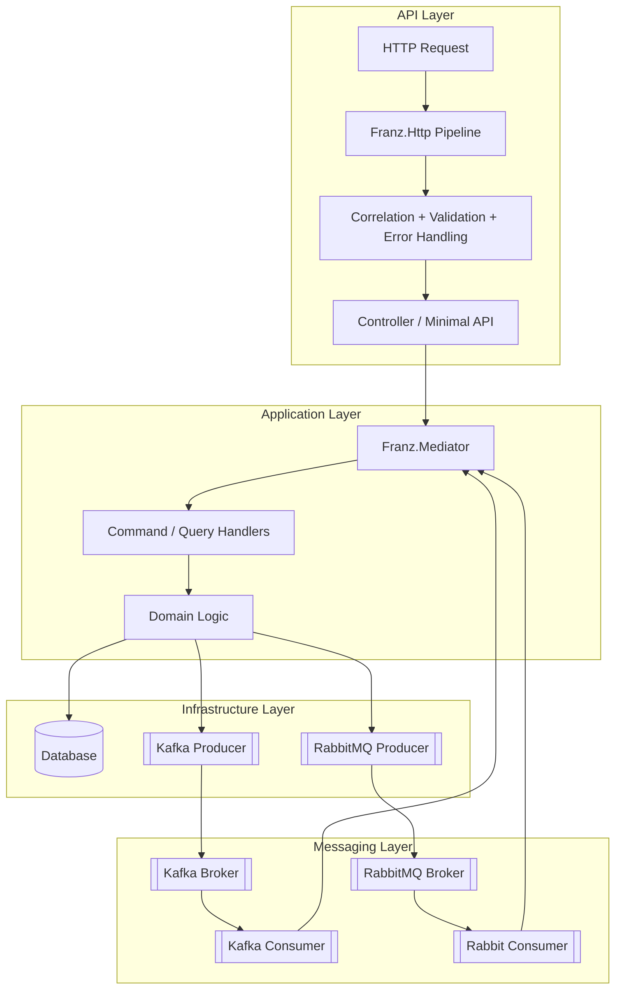
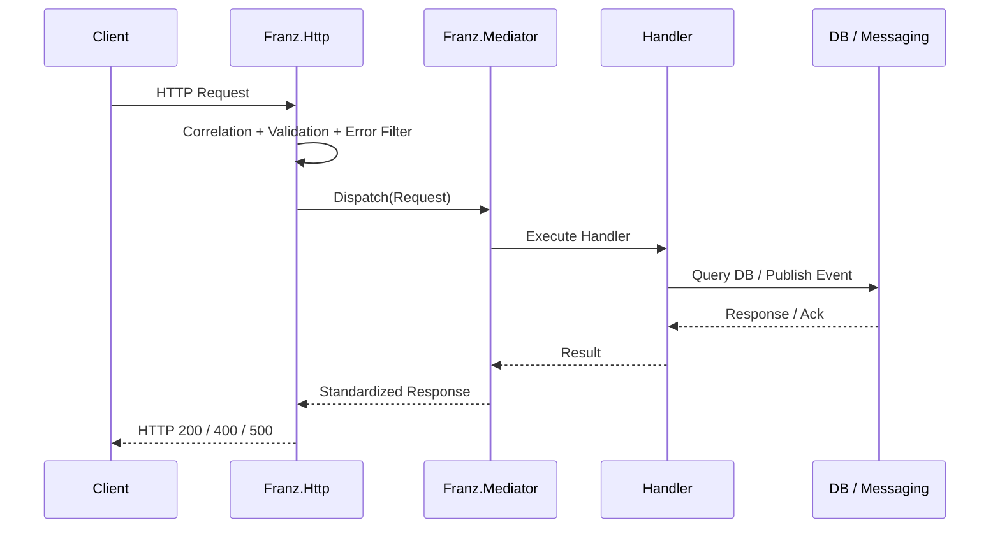
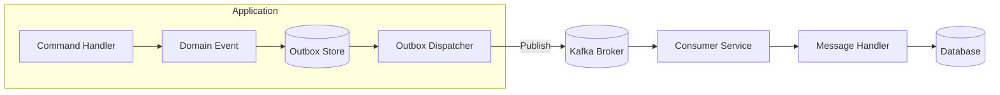
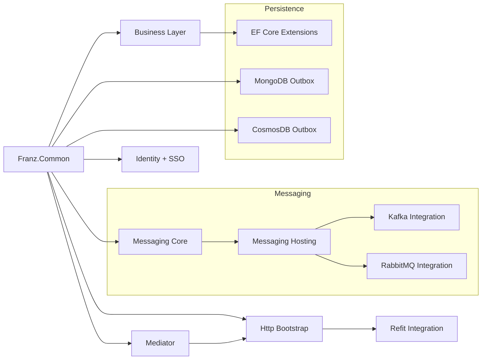

<p align="center">
  
</p>

<h1 align="center">Franz.Common</h1>
<p align="center"><b>Deterministic Architecture for Event-Driven .NET Microservices</b></p>

<p align="center">
  
  
  
  
  
  
  
  
</p>

---

# 📘 Overview

**Franz.Common** is the foundation of the **Franz Framework**, a modular, deterministic architecture layer for **building event-driven microservices in .NET 10**.

It eliminates boilerplate, enforces architectural correctness, and provides **DDD, CQRS, messaging, multi-tenancy, resilience, observability, and identity** capabilities—designed for **scalable, long-lived enterprise systems**.

Franz is **Kafka-first**, but also supports **RabbitMQ, Azure Service Bus, MongoDB, CosmosDB, SQL**, and more.

> **Spring Boot for .NET — but deterministic, clean, and transparent.**

---

# 🎯 Why Franz?

Franz was created to bring **predictability, maintainability, and governance** to distributed .NET systems:

* Reduces **80%+** of architectural boilerplate.
* Enforces **structural correctness** at build time.
* Provides **consistent architecture** across microservices.
* Offers **first-class resilience**, **observability**, and **messaging** patterns.
* Minimizes cognitive load through **unified abstractions**.
* Designed for **enterprise requirements** (multi-tenancy, identity, auditability).

---

# 📦 Subpackages

Franz follows a **"batteries-included but modular"** philosophy.

### **Core**

* `Franz.Common` → Core primitives, serialization, DI, functional utilities.

### **Domain & Application**

* `Franz.Common.Business` → DDD aggregates, domain events, pipelines.
* `Franz.Common.Mediator` → Lightweight CQRS mediator with pipelines.

### **Infrastructure**

* `Franz.Common.EntityFramework` → Auditing, soft deletes, domain event dispatching.
* `Franz.Common.MongoDB` → Mongo outbox/inbox.
* `Franz.Common.AzureCosmosDB` → Cosmos outbox/inbox.

### **Messaging**

* `Franz.Common.Messaging` → Messaging contracts, envelopes, options.
* `Franz.Common.Messaging.Hosting` → Hosted async listeners.
* `Franz.Common.Messaging.Kafka`
* `Franz.Common.Messaging.RabbitMQ`

### **HTTP**

* `Franz.Common.Http.Bootstrap`
* `Franz.Common.Http.Refit`
* `Franz.Common.Http.Identity`
* `Franz.Common.Http.Messaging`

### **Identity**

* `Franz.Common.Identity`
* `Franz.Common.SSO` → Keycloak, OIDC, SAML2, WS-Fed integrations.

---

# 🔐 Security Principles

Franz enforces strict, deterministic security patterns:

* Mandatory **CorrelationId**, **TraceId**, and **TenantId** propagation.
* Deterministic error filters (no sensitive data leakage).
* Centralized **authentication & claims enrichment pipelines**.
* Optional strict mode:

  * no unregistered controllers
  * no unregistered message handlers
  * validation-first execution
* Standardized identity flows across **OIDC, SAML2, Keycloak, WS-Fed**.

These principles make Franz suitable for **regulated environments**, including public institutions and financial sectors.

---

# 🌐 Architecture Overview



---

# 🔄 Runtime Request Lifecycle



---

# 📨 Messaging Flow (Kafka + Outbox)



---

# 🗺️ Franz Ecosystem Map



---

# 🏛️ Architecture Enforcement (Franz Tribunal)

Franz includes an optional **architecture test suite** based on ArchUnitNET:

* Enforces **layer boundaries** (Domain → Application → Infrastructure).
* Forbids **circular dependencies**.
* Enforces **immutable DTOs**.
* Validates naming conventions:

  * Commands, Queries, Events
  * Handlers
  * Controllers
* Ensures no domain leakage into infrastructure and vice-versa.
* Ensures messaging boundaries are respected.

This makes Franz suitable for **large organizations**, where maintaining architectural discipline is critical.

---

# 🚀 Getting Started

### Install the core package:

```bash
dotnet add package Franz.Common --version 1.7.0
```

Messaging example:

```bash
dotnet add package Franz.Common.Messaging.Kafka
```

---

# 💡 Key Features

### ✔ DDD/CQRS First-Class

Entities, value objects, aggregates, events.

### ✔ Mediator with Pipelines

Logging, validation, telemetry, resilience, transactions.

### ✔ Messaging First

Outbox/inbox, retries, DLQ, correlation propagation.

### ✔ Observability

Serilog, OpenTelemetry, structured logs.

### ✔ Multi-tenancy

Tenant resolution across HTTP, messaging, pipelines.

### ✔ Polyglot Persistence

SQL, MongoDB, CosmosDB with unified abstractions.

---

# 🛠️ Build & Test

```bash
git clone https://github.com/bestacio89/Franz.Common.git
cd Franz.Common
dotnet build
dotnet test
```

Kafka integration tests:

```bash
docker-compose up -d
dotnet test --filter Category=Integration
```

---

# ⭐ Version 1.7.0 — Azure Messaging Expansion

* Franz.Common v1.7.0 introduces first-class Azure messaging support, completing cloud transport parity while preserving Franz’s deterministic, mediator-driven architecture.

☁️ Azure Messaging Stack

* Azure Service Bus adapter
  Durable brokered messaging with Franz-native mapping and mediator dispatch.

* Azure Event Hubs adapter
  High-throughput, partitioned streaming for Kafka-style workloads.

* Azure Event Grid adapter
  HTTP-based event ingress with subscription validation and mediator integration.

🧭 Azure Hosting Orchestration

* New Azure hosting layer to orchestrate:

* Service Bus consumers

* Event Hubs processors

* Event Grid HTTP endpoints

* Built on Franz.Common.Messaging.Hosting

* Preserves strict separation between transport and hosting

🧠 Architectural Guarantees

* No AutoMapper, no reflection magic

* Deterministic metadata propagation

* Transport-agnostic mediator pipelines

* Azure support added without coupling business logic

* This release completes the Azure messaging pillar of the Franz ecosystem, alongside Kafka and RabbitMQ.

---

# 🛣️ Roadmap
* Graphql Adapters and Implementations
---

# 🏢 Enterprise Adoption & Support

Franz is maintained with enterprise environments in mind.
For support, consulting, integration guidance, or architectural reviews, please contact the maintainer.

---

# 🤝 Contributing

Pull requests welcome — internal contributors preferred.
All PRs must include **tests**, **documentation**, and comply with **Franz Tribunal** rules.

---

# 📜 License

MIT License.

