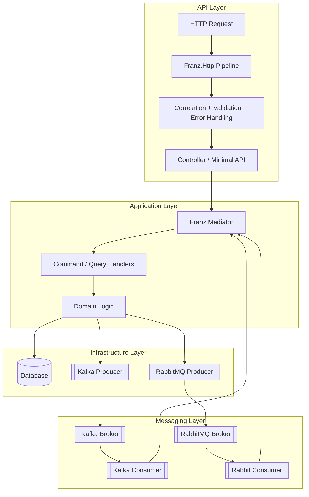
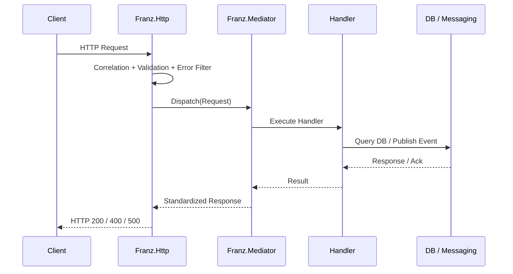
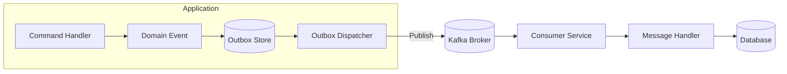
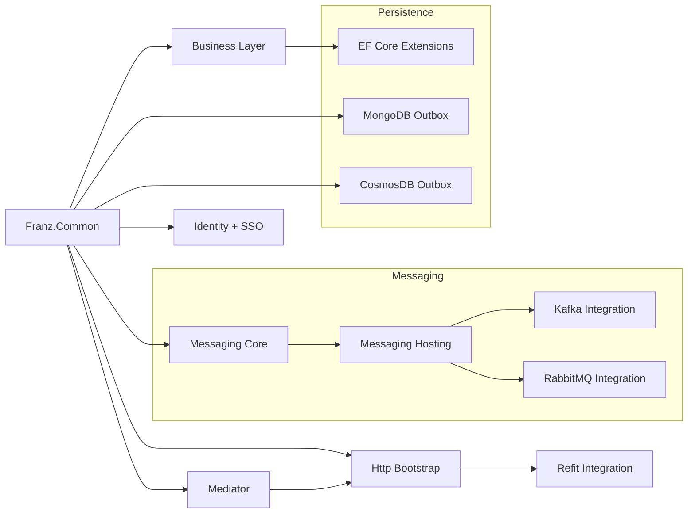

# Franz.Common

**Deterministic Architecture for Event-Driven .NET Microservices**

[](https://dotnet.microsoft.com)
[](https://learn.microsoft.com/en-us/dotnet/core/deploying/native-aot/)
[](https://github.com/bestacio89/Franz.Common)
[](https://kafka.apache.org)
[](https://www.rabbitmq.com)
[](https://azure.microsoft.com/en-us/products/service-bus)
[](https://github.com/bestacio89/Franz.Common)
[](https://github.com/App-vNext/Polly)
[](https://opentelemetry.io)
[](https://github.com/bestacio89/Franz.Common)
[](LICENSE.MD)
[](https://www.nuget.org/packages?q=Franz.Common)

---

## Table of Contents

- [Overview](#-overview)
- [Why Franz?](#-why-franz)
- [Subpackages](#-subpackages)
- [Security Principles](#-security-principles)
- [Architecture Overview](#-architecture-overview)
- [Runtime Request Lifecycle](#-runtime-request-lifecycle)
- [Messaging Flow](#-messaging-flow-kafka--outbox)
- [Ecosystem Map](#-franz-ecosystem-map)
- [Architecture Enforcement](#-architecture-enforcement-franz-tribunal)
- [Key Features](#-key-features)
- [Getting Started](#-getting-started)
- [Build & Test](#-build--test)
- [Changelog](#-changelog)
- [Roadmap](#-roadmap)
- [Enterprise Adoption & Support](#-enterprise-adoption--support)
- [Contributing](#-contributing)
- [License](#-license)

---

# 📘 Overview

**Franz.Common** is the foundation of the **Franz Framework**, a deterministic, factory-driven, AOT-first architecture layer for **building event-driven microservices in .NET 10**.

It eliminates boilerplate, enforces architectural correctness, and provides **DDD, CQRS, messaging, multi-tenancy, resilience, observability, and identity** capabilities — designed for **scalable, long-lived enterprise systems**.

Franz is **Kafka-first**, but also supports **RabbitMQ, Azure Service Bus, MongoDB, CosmosDB, SQL**, and more.

> **Spring Boot for .NET — but deterministic, clean, and transparent.**

---

# 🎯 Why Franz?

Franz was created to bring **predictability, maintainability, and governance** to distributed .NET systems:

- Reduces **80%+** of architectural boilerplate.
- Enforces **structural correctness** at build time, not at code review.
- Provides **consistent architecture** across microservices — swap SQL Server for Postgres, Kafka for RabbitMQ, with zero domain changes.
- Offers **first-class resilience**, **observability**, and **messaging** patterns out of the box.
- Minimizes cognitive load through **unified abstractions**.
- Designed for **enterprise requirements** (multi-tenancy, identity, auditability).

Franz isn't a library collection — it's a platform with guarantees. The architecture you get from following the pattern is the architecture you'd get from a senior architect reviewing every PR, except enforced automatically at build time.

---

# 📦 Subpackages

Franz follows a **"batteries-included but modular"** philosophy.

### Core
- `Franz.Common` → Core primitives, serialization, DI, functional utilities.

### Domain & Application
- `Franz.Common.Business` → DDD aggregates, domain events, factories, pipelines.
- `Franz.Common.Mediator` → Lightweight CQRS mediator with pipelines.

### Infrastructure
- `Franz.Common.EntityFramework` → Auditing, soft deletes, domain event dispatching.
- `Franz.Common.MongoDB` → Mongo outbox/inbox.
- `Franz.Common.AzureCosmosDB` → Cosmos outbox/inbox.

### Messaging
- `Franz.Common.Messaging` → Messaging contracts, envelopes, options.
- `Franz.Common.Messaging.Hosting` → Hosted async listeners.
- `Franz.Common.Messaging.Kafka`
- `Franz.Common.Messaging.RabbitMQ`

### HTTP
- `Franz.Common.Http.Bootstrap`
- `Franz.Common.Http.Refit`
- `Franz.Common.Http.Identity`
- `Franz.Common.Http.Messaging`

### Identity
- `Franz.Common.Identity`
- `Franz.Common.SSO` → Keycloak, OIDC, SAML2, WS-Fed integrations.

---

# 🔐 Security Principles

Franz enforces strict, deterministic security patterns:

- Mandatory **CorrelationId**, **TraceId**, and **TenantId** propagation.
- Deterministic error filters (no sensitive data leakage).
- Centralized **authentication & claims enrichment pipelines**.
- Optional strict mode:
  - no unregistered controllers
  - no unregistered message handlers
  - validation-first execution
- Standardized identity flows across **OIDC, SAML2, Keycloak, WS-Fed**.

These principles make Franz suitable for **regulated environments**, including public institutions and financial sectors.

---

# 🌐 Architecture Overview


```mermaid
flowchart TD

subgraph API Layer
    A[HTTP Request] --> B[Franz.Http Pipeline]
    B --> C[Correlation + Validation + Error Handling]
    C --> D[Controller / Minimal API]
end

subgraph Application Layer
    D --> E[Franz.Mediator]
    E --> F[Command / Query Handlers]
    F --> G[Domain Logic]
end

subgraph Infrastructure Layer
    G --> H[(Database)]
    G --> I[[Kafka Producer]]
    G --> J[[RabbitMQ Producer]]
end

subgraph Messaging Layer
    I --> K[[Kafka Broker]]
    J --> L[[RabbitMQ Broker]]
    K --> M[[Kafka Consumer]]
    L --> N[[Rabbit Consumer]]
    M --> E
    N --> E
end
```

---

# 🔄 Runtime Request Lifecycle


```mermaid
sequenceDiagram
    participant Client
    participant API as Franz.Http
    participant Mediator as Franz.Mediator
    participant Handler
    participant Infra as DB / Messaging

    Client->>API: HTTP Request
    API->>API: Correlation + Validation + Error Filter
    API->>Mediator: Dispatch(Request)
    Mediator->>Handler: Execute Handler
    Handler->>Infra: Query DB / Publish Event
    Infra-->>Handler: Response / Ack
    Handler-->>Mediator: Result
    Mediator-->>API: Standardized Response
    API-->>Client: HTTP 200 / 400 / 500
```

---

# 📨 Messaging Flow (Kafka + Outbox)


```mermaid
flowchart LR

subgraph Application
    A[Command Handler] --> B[Domain Event]
    B --> C[(Outbox Store)]
    C --> D[Outbox Dispatcher]
end

D -->|Publish| E[(Kafka Broker)]
E --> F[Consumer Service]
F --> G[Message Handler]
G --> H[(Database)]
```

---

# 🗺️ Franz Ecosystem Map


```mermaid
flowchart LR

Core[Franz.Common]
Business[Business Layer]
Mediator[Mediator]
HttpBoot[Http Bootstrap]
Refit[Refit Integration]
Identity[Identity + SSO]

subgraph Messaging
  MsgCore[Messaging Core]
  MsgHost[Messaging Hosting]
  Kafka[Kafka Integration]
  Rabbit[RabbitMQ Integration]
end

subgraph Persistence
  EF[EF Core Extensions]
  Mongo[MongoDB Outbox]
  Cosmos[CosmosDB Outbox]
end

Core --> Business
Core --> Mediator
Core --> HttpBoot
Core --> MsgCore
Core --> Identity

Business --> EF
Mediator --> HttpBoot
HttpBoot --> Refit

MsgCore --> MsgHost
MsgHost --> Kafka
MsgHost --> Rabbit

Core --> Mongo
Core --> Cosmos
```

---

# 🏛️ Architecture Enforcement (Franz Tribunal)

Franz includes an optional **architecture test suite** based on ArchUnitNET — internally referred to as the **Franz Tribunal**:

- Enforces **layer boundaries** (Domain → Application → Infrastructure).
- Forbids **circular dependencies**.
- Enforces **immutable DTOs**.
- Validates naming conventions: Commands, Queries, Events, Handlers, Controllers.
- Ensures no domain leakage into infrastructure and vice-versa.
- Ensures messaging boundaries are respected.

These rules run in CI on every pull request. A violation fails the build — not a code review comment, a hard stop. This makes Franz suitable for **large organizations**, where maintaining architectural discipline across many contributors and services is critical, not optional.

---

# 💡 Key Features

### ✔ DDD/CQRS First-Class
Entities, value objects, aggregates, events — all factory-controlled, identity-safe, and persistence-agnostic.

### ✔ High-Performance Entity & Aggregate Factories
`EntityFactory<TKey, TEntity>` and `AggregateFactory<TAggregate, TEvent>` use **compiled expression tree delegates** cached statically per closed generic type. Constructor resolution happens once at startup — runtime creation is near-native with zero reflection overhead. Misconfigured types are caught at DI registration time via `Validate()`, not at first use.

### ✔ Native Object Mapping
`FranzMapper` detects value objects structurally via base-class inheritance — no `[Attribute]` decoration required across your domain. Supports immutable records, `init`-only properties, nested object graphs with true circular-reference detection, and full collection coercion (arrays, `HashSet<T>`, `IReadOnlyList<T>`). Zero external mapping library dependency.

### ✔ Mediator with Pipelines
Logging, validation, telemetry, resilience, transactions — composable, opt-in, zero hidden middleware.

### ✔ Messaging First
Outbox/inbox, retries, DLQ, correlation propagation. Supports both **service-level** topic routing and **event-level** topic routing — register a Kafka topic per service, or per individual domain event, depending on your consumption pattern.

### ✔ Observability
Serilog, OpenTelemetry, structured logs, mandatory correlation propagation across HTTP, messaging, and pipelines.

### ✔ Multi-tenancy
Tenant resolution across HTTP, messaging, pipelines.

### ✔ Polyglot Persistence
SQL Server, Postgres, Oracle, MariaDB, MongoDB, CosmosDB — all behind unified abstractions. Swapping a provider is a registration change, not a rewrite.

---

# 🚀 Getting Started

### Install the core package:

```bash
dotnet add package Franz.Common --version 2.2.15
```

Messaging example:

```bash
dotnet add package Franz.Common.Messaging.Kafka
```

Minimal `Program.cs` wiring:

```csharp
builder.Host.UseLog();
builder.Services
    .AddFranzSerilogAuditPipeline()
    .AddFranzEventValidationPipeline()
    .AddFranzSerilogLoggingPipeline()
    .AddFranzTelemetry(env, config);

builder.Services.AddRelationalDatabase<ApplicationDbContext>(env, config);
builder.Services.AddHttpArchitecture(env, config);
builder.Services.AddFranzMediator(new[] { typeof(CreateOrderCommandHandler).Assembly });
builder.Services.AddFranzResilience(config);
```

That's the full subsystem wiring for logging, persistence, HTTP, mediator, and resilience — no boilerplate beyond what's shown above.

---

# 🛠️ Build & Test

```bash
git clone https://github.com/bestacio89/Franz.Common.git
cd Franz.Common
dotnet build
dotnet test
```

Kafka integration tests (real broker via Testcontainers, not mocks):

```bash
docker-compose up -d
dotnet test --filter Category=Integration
```

---

# 📋 Changelog

Full version history lives in [`changelog.md`](changelog.md). Recent highlights:

## v2.2.16 — Execution Boundary Alignment & Logging Noise Reduction

**Changed**

* Unified execution ownership: validation remains exclusively within the Mediator pipeline, reinforcing the Mediator as the system execution kernel.
* `FranzGlobalExceptionHandler` now explicitly relies on Mediator-level exception contracts (`ValidationException`, `BusinessException`) for HTTP translation, removing ambiguity around validation ownership.
* Logging configuration (`UseLog` / `UseHybridLog`) updated to suppress ASP.NET Core MVC infrastructure noise (`ControllerActionInvoker`, `ObjectResultExecutor`, formatter selection, routing/model binding internals).
* Request pipeline observability reduced to request lifecycle, application logs, and Franz domain-level events only.

**Improved**

* Stronger separation of concerns between:

  * Mediator (execution + validation + business rule enforcement)
  * HTTP Bootstrap (transport translation only)
  * Logging layer (application + domain observability only)
* More stable log signal-to-noise ratio for production and debugging environments.
* Consistent exception-to-HTTP mapping aligned with execution semantics.

**Fixed**

* Overly verbose ASP.NET Core MVC logging (formatter negotiation, execution plans, and internal invoker traces) removed from default logging output.
* Redundant framework-level diagnostic logs no longer pollute application-level observability streams.

**Migration**

* No breaking changes.
* Optional: review logging filters if custom ASP.NET Core sources were previously depended on (they may now be excluded by default in `UseLog()`).

**Notes**

* Validation exceptions remain owned by the Mediator pipeline and are intentionally *not duplicated* in HTTP or domain error layers.
* HTTP bootstrap now acts strictly as a translation boundary for execution results produced by the Mediator engine.


## v2.2.8 — Entity Repository Resolution

**Fixed**
- Bug fixes in the automatic resolution of Entity Repositories.

---

# 🛣️ Roadmap

- GraphQL Adapters and Implementations
- SignalR Adapters and Implementations

---

# 🏢 Enterprise Adoption & Support

Franz is maintained with enterprise environments in mind.
For support, consulting, integration guidance, or architectural reviews, please contact the maintainer.

---

# 🤝 Contributing

Pull requests welcome — internal contributors preferred.
All PRs must include **tests**, **documentation**, and comply with **Franz Tribunal** rules.

---

# 📜 License

MIT License.