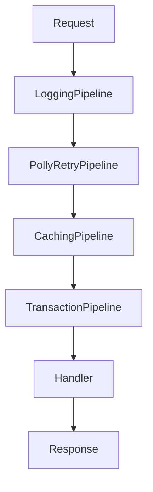

# 🚀 Full Example: Franz.Common.Mediator in Action

This demo shows how to use **Franz.Common.Mediator** with multiple pipelines (logging, retry, caching, transaction) around a simple command handler.

---

## 1. Command + Handler

```csharp
public record CreateOrderCommand(Guid OrderId, decimal Amount) : ICommand<bool>;

public class CreateOrderHandler : ICommandHandler<CreateOrderCommand, bool>
{
    private readonly OrdersDbContext _db;
    public CreateOrderHandler(OrdersDbContext db) => _db = db;

    public async Task<bool> Handle(CreateOrderCommand request, CancellationToken ct)
    {
        _db.Orders.Add(new Order { Id = request.OrderId, Amount = request.Amount });
        await _db.SaveChangesAsync(ct);
        return true;
    }
}
```

---

## 2. Pipelines

### Logging Pipeline

```csharp
public class LoggingPipeline<TRequest, TResponse> : IPipeline<TRequest, TResponse>
{
    private readonly ILogger<LoggingPipeline<TRequest, TResponse>> _logger;

    public LoggingPipeline(ILogger<LoggingPipeline<TRequest, TResponse>> logger) 
        => _logger = logger;

    public async Task<TResponse> Handle(TRequest request, CancellationToken ct, Func<Task<TResponse>> next)
    {
        _logger.LogInformation("Handling {Request}", typeof(TRequest).Name);
        var response = await next();
        _logger.LogInformation("Handled {Request} with {Response}", typeof(TRequest).Name, typeof(TResponse).Name);
        return response;
    }
}
```

### Polly Retry Pipeline

```csharp
public class PollyRetryPipeline<TRequest, TResponse> : IPipeline<TRequest, TResponse>
{
    private readonly AsyncPolicy _policy;

    public PollyRetryPipeline(RetryOptions options)
    {
        _policy = Policy
            .Handle<Exception>();
        if (options.MaxRetries > 0)
            _policy = _policy.WaitAndRetryAsync(options.MaxRetries, _ => options.Delay);
    }

    public Task<TResponse> Handle(TRequest request, CancellationToken ct, Func<Task<TResponse>> next)
        => _policy.ExecuteAsync(() => next());
}
```

### Caching Pipeline

```csharp
public class CachingPipeline<TRequest, TResponse> : IPipeline<TRequest, TResponse>
{
    private readonly IMemoryCache _cache;
    private readonly CachingOptions _options;

    public CachingPipeline(IMemoryCache cache, CachingOptions options)
    {
        _cache = cache;
        _options = options;
    }

    public async Task<TResponse> Handle(TRequest request, CancellationToken ct, Func<Task<TResponse>> next)
    {
        var key = $"{typeof(TRequest).Name}:{request.GetHashCode()}";
        if (_cache.TryGetValue<TResponse>(key, out var cached))
            return cached;

        var result = await next();
        _cache.Set(key, result, _options.Duration);
        return result;
    }
}
```

### Transaction Pipeline

```csharp
public class TransactionPipeline<TRequest, TResponse> : IPipeline<TRequest, TResponse>
{
    private readonly OrdersDbContext _db;

    public TransactionPipeline(OrdersDbContext db) => _db = db;

    public async Task<TResponse> Handle(TRequest request, CancellationToken ct, Func<Task<TResponse>> next)
    {
        using var tx = await _db.Database.BeginTransactionAsync(ct);
        try
        {
            var response = await next();
            await tx.CommitAsync(ct);
            return response;
        }
        catch
        {
            await tx.RollbackAsync(ct);
            throw;
        }
    }
}
```

---

## 3. Dependency Injection Setup

```csharp
services.AddDbContext<OrdersDbContext>(...);
services.AddMemoryCache();

services.AddFranzMediator(typeof(CreateOrderHandler).Assembly, options =>
{
    options.Retry.MaxRetries = 3;
    options.Retry.Delay = TimeSpan.FromMilliseconds(200);
    options.Caching.Duration = TimeSpan.FromMinutes(1);
});

services.AddScoped(typeof(IPipeline<,>), typeof(LoggingPipeline<,>));
services.AddScoped(typeof(IPipeline<,>), typeof(PollyRetryPipeline<,>));
services.AddScoped(typeof(IPipeline<,>), typeof(CachingPipeline<,>));
services.AddScoped(typeof(IPipeline<,>), typeof(TransactionPipeline<,>));
```

---

## 4. Using the Mediator

```csharp
[ApiController]
[Route("orders")]
public class OrdersController : ControllerBase
{
    private readonly IDispatcher _dispatcher;
    public OrdersController(IDispatcher dispatcher) => _dispatcher = dispatcher;

    [HttpPost]
    public async Task<IActionResult> CreateOrder(CreateOrderCommand command, CancellationToken ct)
    {
        var success = await _dispatcher.Dispatch(command, ct);
        return success ? Ok() : BadRequest();
    }
}
```

---

## 5. Execution Flow

Dispatching `CreateOrderCommand` triggers pipelines in order:

1. Logging → logs before/after  
2. Retry → retries on transient errors  
3. Caching → short-circuits if already cached  
4. Transaction → wrap DB in transaction  
5. Handler → executes logic  

---

## 6. Visual Diagram



---

✅ Clone this example, run it, and extend with your own pipelines (e.g., metrics, validation, telemetry).
