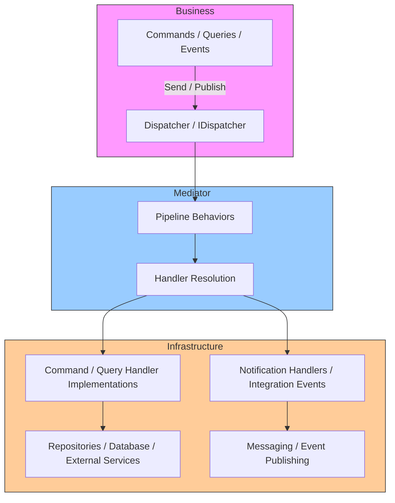

# Franz.Common.Mediator

`Franz.Common.Mediator` is the **core mediator library** for the Franz framework.
It provides **request/response handling**, **notifications**, and **pipeline behaviors**, fully decoupled from business models and infrastructure.

---

## 📂 Project Structure

```
Franz.Common/
 ├── Franz.Common.Business/         # Domain models, ValueObjects, Commands, Queries
 ├── Franz.Common.Mediator/         # Mediator abstractions, dispatcher, pipelines, handlers
 │    ├── Messages/                 # ICommand, IQuery, INotification definitions
 │    ├── Handlers/                 # ICommandHandler, IQueryHandler, INotificationHandler
 │    ├── Pipelines/                # IPipeline and custom pipeline behaviors
 │    └── Dispatchers/              # Dispatcher implementing Send/Publish
 ├── Franz.Common.Infrastructure/   # Handler implementations, database or messaging integrations
 └── Franz.Common.Tests/            # Unit tests for Business and Mediator layers
```

---

## ⚡ Usage

### 1. Define Commands and Queries (Business Layer)

```csharp
using Franz.Common.Mediator.Messages;

public record CreateUserCommand(string Name, string Email) : ICommand<Guid>;

public record GetUserQuery(Guid Id) : IQuery<User>;
```

### 2. Implement Handlers (Infrastructure Layer)

```csharp
using Franz.Common.Mediator.Handlers;
using Franz.Common.Business.Domain;

public class CreateUserHandler : ICommandHandler<CreateUserCommand, Guid>
{
    private readonly IUserRepository _repository;

    public CreateUserHandler(IUserRepository repository)
        => _repository = repository;

    public async Task<Guid> Handle(CreateUserCommand request, CancellationToken cancellationToken)
    {
        var user = new User(request.Name, request.Email);
        await _repository.AddAsync(user);
        return user.Id;
    }
}
```

```csharp
public class GetUserHandler : IQueryHandler<GetUserQuery, User>
{
    private readonly IUserRepository _repository;

    public GetUserHandler(IUserRepository repository)
        => _repository = repository;

    public Task<User> Handle(GetUserQuery request, CancellationToken cancellationToken)
        => _repository.GetByIdAsync(request.Id);
}
```

### 3. Register Mediator in DI Container

```csharp
using Microsoft.Extensions.DependencyInjection;
using Franz.Common.Mediator;

var services = new ServiceCollection();

services
    .AddMediator(typeof(Dispatcher).Assembly)   // Registers pipelines and handlers
    .AddDependencies();                          // Add business and infrastructure dependencies
```

### 4. Send Commands and Queries

```csharp
var dispatcher = serviceProvider.GetRequiredService<IDispatcher>();

// Send a command
var userId = await dispatcher.Send(new CreateUserCommand("Alice", "alice@example.com"));

// Send a query
var user = await dispatcher.Send(new GetUserQuery(userId));
```

---

## 🧩 Pipeline Behaviors

Custom behaviors can be applied globally:

```csharp
using Franz.Common.Mediator.Pipelines;
using Franz.Common.EntityFramework.Behaviors;

services.AddTransient(typeof(IPipeline<,>), typeof(PersistenceBehavior<,>));
services.AddTransient(typeof(IPipeline<,>), typeof(LoggingBehavior<,>));
services.AddTransient(typeof(IPipeline<,>), typeof(ValidationBehavior<,>));
```

---

## 📢 Notifications (Integration Events)

```csharp
using Franz.Common.Mediator.Messages;

public record UserCreatedEvent(User User) : INotification;

public class UserCreatedHandler : INotificationHandler<UserCreatedEvent>
{
    public Task Handle(UserCreatedEvent notification, CancellationToken cancellationToken)
    {
        Console.WriteLine($"User created: {notification.User.Id}");
        return Task.CompletedTask;
    }
}

// Publishing a notification
await dispatcher.Publish(new UserCreatedEvent(user));
```

---

## 🧪 Unit Tests

All existing unit tests in `Franz.Common.Business.Tests` and `Franz.Common.Mediator.Tests` ensure **value objects**, **commands/queries**, and **notifications** behave correctly:

```csharp
[Fact]
public void Copy_SameValueObjectAfter_ReturnsTrue()
{
    var addresseCopie = AddresseUnique.GetCopy();
    Assert.True(addresseCopie.Equals(AddresseUnique));
}
```

Run all tests:

```bash
dotnet test
```

---

## 🔧 Integration

* **Dispatcher** resolves handlers from DI automatically.
* Pipelines (logging, validation, persistence) are fully pluggable.
* Supports **commands**, **queries**, and **notifications** in a clean separation of concerns.
* Independent of MediatR — Franz.Common.Mediator is the authoritative mediator layer.

---

## 📜 License

MIT

---




## 📈 Changelog

### Version 1.3
- Upgraded to **.NET 9.0.8**
- Added **new features and improvements**
- Separated **business concepts** from **mediator concepts**
- Now compatible with both the **in-house mediator** and **MediatR**