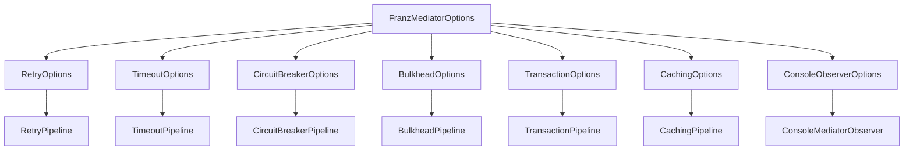

# Franz.Common.Mediator

Franz.Common.Mediator is a **production-grade mediator library** for .NET that goes beyond MediatR.
It’s **framework-agnostic, configurable, observable, resilient, and testable** — built for real enterprise systems.

Unlike minimal mediators, Franz ships with:

* Clean **contracts** (commands, queries, notifications, streams).
* Plug-and-play **pipelines** for logging, validation, retry, caching, transactions, circuit breakers, bulkheads, and more.
* **Options-driven configuration** (no hardcoded values).
* Built-in **observability** with correlation IDs, multi-tenant context, and per-handler telemetry.
* Unified **Result/Error** handling with structured metadata.
* A lightweight **TestDispatcher** for easy unit testing.

---

## 📦 Installation

```bash
dotnet add package Franz.Common.Mediator
```

---

## 🚀 Quick Start

### 1. Define a Command and Handler

```csharp
public record CreateUserCommand(string Username, string Email) : ICommand<Result<Guid>>;

public class CreateUserHandler : ICommandHandler<CreateUserCommand, Result<Guid>>
{
    public async Task<Result<Guid>> Handle(CreateUserCommand request, CancellationToken ct)
    {
        if (string.IsNullOrWhiteSpace(request.Email))
            return Result<Guid>.Failure("Invalid email");

        return Result<Guid>.Success(Guid.NewGuid());
    }
}
```

### 2. Wire Mediator in DI

```csharp
using Franz.Common.Mediator.Extensions;
using System.Reflection;

services.AddFranzMediator(
    new[] { Assembly.GetExecutingAssembly() },
    options =>
    {
        options.Retry.MaxRetries = 3;
        options.Timeout.Duration = TimeSpan.FromSeconds(2);
        options.CircuitBreaker.FailuresAllowedBeforeBreaking = 5;
        options.Bulkhead.MaxParallelization = 20;
        options.Transaction.IsolationLevel = System.Data.IsolationLevel.ReadCommitted;
        options.Caching.Duration = TimeSpan.FromMinutes(5);

        options.EnableDefaultConsoleObserver = true;
    });
```

### 3. Dispatch from your app

```csharp
var result = await dispatcher.Send(new CreateUserCommand("bob", "bob@example.com"));

if (result.IsSuccess)
    Console.WriteLine($"Created user {result.Value}");
else
    Console.WriteLine($"Failed: {result.Error.Message}");
```

---

## 🧩 Pipelines (Cross-Cutting Concerns)

Franz ships with many built-in pipelines, all **options-driven**:

* **LoggingPipeline** → request/response logging.
* **ValidationPipeline** → runs all `IValidator<TRequest>`.
* **RetryPipeline** → retry transient errors.
* **TimeoutPipeline** → cancel long-running requests.
* **CircuitBreakerPipeline** → stop calling failing handlers.
* **BulkheadPipeline** → limit concurrent requests.
* **CachingPipeline** → cache query results.
* **TransactionPipeline** → commit/rollback with `IUnitOfWork`.

Example pipeline:

```csharp
public class RetryPipeline<TRequest, TResponse> : IPipeline<TRequest, TResponse>
{
    private readonly RetryOptions _options;

    public RetryPipeline(RetryOptions options) => _options = options;

    public async Task<TResponse> Handle(TRequest request, CancellationToken ct, Func<Task<TResponse>> next)
    {
        for (int i = 0; i < _options.MaxRetries; i++)
        {
            try { return await next(); }
            catch when (i < _options.MaxRetries - 1)
            {
                await Task.Delay(_options.Delay, ct);
            }
        }
        throw new Exception("Retries exhausted.");
    }
}
```

---

## 📋 Options Pattern

All pipeline settings are configured centrally with `FranzMediatorOptions`:

```csharp
namespace Franz.Common.Mediator.Options
{
    public class FranzMediatorOptions
    {
        public RetryOptions Retry { get; set; } = new();
        public TimeoutOptions Timeout { get; set; } = new();
        public CircuitBreakerOptions CircuitBreaker { get; set; } = new();
        public BulkheadOptions Bulkhead { get; set; } = new();
        public CachingOptions Caching { get; set; } = new();
        public TransactionOptions Transaction { get; set; } = new();
        public ConsoleObserverOptions ConsoleObserver { get; set; } = new();

        public bool EnableDefaultConsoleObserver { get; set; } = false;
    }
}
```

---

## ⚙️ Configuring Pipelines with Options

In `Program.cs`:

```csharp
builder.Services.AddFranzMediator(
    new[] { Assembly.GetExecutingAssembly() },
    options =>
    {
        // Resilience
        options.Retry.MaxRetries = 3;
        options.Timeout.Duration = TimeSpan.FromSeconds(10);
        options.CircuitBreaker.FailuresAllowedBeforeBreaking = 5;
        options.Bulkhead.MaxParallelization = 20;

        // Transaction & caching
        options.Transaction.IsolationLevel = System.Data.IsolationLevel.ReadCommitted;
        options.Caching.Duration = TimeSpan.FromMinutes(5);

        // Observer
        options.EnableDefaultConsoleObserver = true;
    });
```

### Dependency Injection of Options

`AddFranzMediator` wires up sub-options so pipelines can resolve them:

```csharp
services.AddSingleton(franzOptions);

services.AddScoped(sp => sp.GetRequiredService<FranzMediatorOptions>().Retry);
services.AddScoped(sp => sp.GetRequiredService<FranzMediatorOptions>().Timeout);
services.AddScoped(sp => sp.GetRequiredService<FranzMediatorOptions>().CircuitBreaker);
services.AddScoped(sp => sp.GetRequiredService<FranzMediatorOptions>().Bulkhead);
services.AddScoped(sp => sp.GetRequiredService<FranzMediatorOptions>().Transaction);
services.AddScoped(sp => sp.GetRequiredService<FranzMediatorOptions>().Caching);
services.AddScoped(sp => sp.GetRequiredService<FranzMediatorOptions>().ConsoleObserver);
```

Each pipeline then requests its own options via constructor injection.

---

### Visual Map



---

## 🔍 Observability & Context

Every request/notification/stream is observable via `IMediatorObserver`.

```csharp
public class ConsoleMediatorObserver : IMediatorObserver
{
    public Task OnRequestStarted(Type req, string correlationId) =>
        Task.Run(() => Console.WriteLine($"➡ {req.Name} started [{correlationId}]"));

    public Task OnRequestCompleted(Type req, string correlationId, TimeSpan duration) =>
        Task.Run(() => Console.WriteLine($"✅ {req.Name} completed in {duration.TotalMilliseconds} ms"));

    public Task OnRequestFailed(Type req, string correlationId, Exception ex) =>
        Task.Run(() => Console.WriteLine($"❌ {req.Name} failed: {ex.Message}"));
}
```

`MediatorContext` is available everywhere (pipelines, handlers):

```csharp
MediatorContext.Current.UserId
MediatorContext.Current.TenantId
MediatorContext.Current.CorrelationId
```

---

## ❗ Error & Result Handling

Every handler returns a `Result` or `Result<T>`.

```csharp
if (!result.IsSuccess)
{
    Console.WriteLine(result.Error.Code);     // e.g., "ValidationError"
    Console.WriteLine(result.Error.Message);  // e.g., "Email is required"
}
```

---

## 🧪 Testing

Use `TestDispatcher` to run handlers without DI:

```csharp
var dispatcher = new TestDispatcher()
    .WithHandler(new CreateUserHandler())
    .WithPipeline(new LoggingPipeline<,>());

var result = await dispatcher.Send(new CreateUserCommand("bob", "bob@example.com"));

Assert.True(result.IsSuccess);
```

---

## 🌐 ASP.NET Core Integration

```csharp
app.MapPost("/users", async (CreateUserCommand cmd, IDispatcher dispatcher) =>
{
    var result = await dispatcher.Send(cmd);
    return result.ToIResult(); // Ok() or Problem()
});
```

---

## 📐 Design Principles

* **Framework-agnostic**
* **Contracts only** (no infra hardcoding)
* **Options-driven**
* **Observable & resilient**
* **Testable**

---

## 📜 License

MIT

---

## 📝 Changelog


### v1.3.4 – 2025-09-15

* Introduced Options pattern.
* Upgraded pipelines to be options-aware.
* Added MediatorContext & observability.
* Introduced TestDispatcher.


### v1.3.5 – 2025-09-17

* Fixed pipeline registration (open generics for DI).
* Registered sub-options for DI (Retry, Timeout, CircuitBreaker, Bulkhead, Transaction, Caching, Observer).
* Updated README with DI & options example.

### v1.3.6 – 2025-09-15
* Removed MediatR → now fully Franz.Mediator.
* IIntegrationEvent : INotification for clean event flow.
* IDispatcher.PublishAsync powers event handling & pipelines.
* Works standalone, no DI required.

### v1.3.7 – 2025-09-17
* Pipelines are now opt-in

### v1.3.12 -2025-09-18
* LoggingPreProcessor now logs using the actual runtime request name instead of generic ICommand\1/IQuery`1`.

* LoggingPostProcessor enriched with prefixes → [Post-Command], [Post-Query], [Post-Request].

* Both Pre/Post processors now provide business-level observability (Command vs Query vs Request).

* Logs are lightweight, clean, and consistent across the full request lifecycle.

### v1.3.13 – Environment-Aware Validation & Audit Logging

* Validation Pipeline

* Enhanced ValidationPipeline<TRequest, TResponse> to include environment-aware logging.

* Development → logs full error details and “passed” messages.

* Production → logs only error counts, no success noise.

* Notification Validation

* Added NotificationValidationPipeline<TNotification> with matching Dev/Prod logging strategy.

* Introduced NotificationValidationException carrying validation errors.

* Audit Post Processor

* Replaced Console.WriteLine with structured ILogger logging.

* Added environment-aware verbosity:

* Development → logs request + full response.

* Production → logs only request completion.

* Validation Pre Processor

* Upgraded ValidationPreProcessor<TRequest> to log validation outcomes consistently.

* Development → logs all validation errors or “passed” messages.

* Production → logs only error counts.

* Consistency

* All validation and audit processors now align with the same Dev = verbose / Prod = lean logging pattern used across pipelines.

### Version 1.3.14


* Correlation IDs

* Unified correlation ID handling across all mediator pipelines (PreProcessor, CorePipeline, PostProcessor, and NotificationPipeline).

* Introduced consistent correlation propagation using Franz.Common.Logging.CorrelationId.

* Correlation IDs now flow automatically through all logs (ILogger + Serilog).

* Support for reusing an existing correlation ID (e.g. incoming X-Correlation-ID header) or generating a new one when missing.

* Logging Enhancements

* Added correlation ID output to pre-, post-, and pipeline logs, ensuring end-to-end traceability.

* Improved SerilogLoggingPipeline with LogContext.PushProperty so correlation metadata enriches all log events in scope.

* Development vs Production modes respected:

* Dev → full request/response payloads logged.

* Prod → minimal structured logs with correlation ID + request name.

🛠️ Internal

* Centralized CorrelationId into Franz.Common.Logging namespace for reuse across all processors and pipelines.

* Removed duplicate/inline correlation ID generators from individual pipelines.

### v1.4.0 – 2025-09-20
Major Refinements to Resilience & Pipeline Architecture

This release focuses on hardening the core mediator pipelines to be more predictable, thread-safe, and robust for production environments.

🛠️ Core Pipeline & Dependency Injection

Opt-In Pipeline Registration: All pipelines are now registered individually (AddFranzRetryPipeline, etc.). This gives the consuming application explicit control over the pipeline order, ensuring predictable behavior and avoiding the critical flaw of fixed, implicit ordering.

Simplified DI: Removed the AddFranzResiliencePipelines method to enforce explicit registration.

Resilience Pipelines

RetryPipeline

Flexible Retry Logic: The catch (Exception) has been replaced with a configurable ShouldRetry predicate. This correctly handles only transient exceptions and prevents the anti-pattern of retrying on permanent failures (e.g., ArgumentException).

Custom Delay Strategies: Added a ComputeDelay delegate to support custom backoff strategies (e.g., exponential backoff), making the pipeline highly adaptable.

Cancellation Handling: Added an explicit check for OperationCanceledException to fail fast when a request is intentionally canceled by the caller.

BulkheadPipeline

Correct Queue Limiting: The logic for handling MaxQueueLength was corrected. The pipeline now uses a non-blocking SemaphoreSlim.WaitAsync(TimeSpan.Zero) to check for available slots, correctly implementing a queue limit and preventing the "thundering herd" problem.

CircuitBreakerPipeline

Thread-Safety & Deadlock Prevention: The long-held lock was removed. The pipeline now uses a lock-free design for the core execution block. This prevents performance bottlenecks under high concurrency and eliminates the risk of deadlocks.

Half-Open State: Implemented the correct Half-Open state, where a single request is allowed to test the waters after the circuit has been open. This is a critical feature for a proper circuit breaker.

State Management: Moved state management logic into a dedicated, thread-safe helper method to ensure consistent behavior.

General Enhancements

Improved Observability: All pipelines and processors are now more tightly integrated with IMediatorObserver to provide consistent, end-to-end traceability of requests, including their final outcomes (success or failure).

This update transforms the mediator from a functional library into a highly reliable and architecturally sound framework.