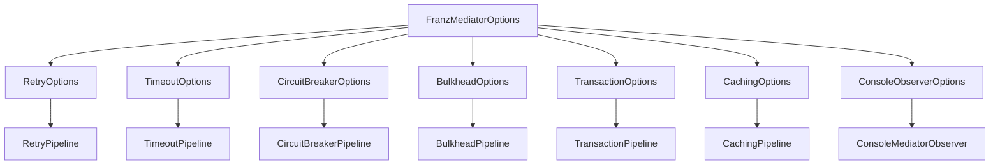

# Franz.Common.Mediator

Franz.Common.Mediator is a **production-grade mediator library** for .NET that goes beyond MediatR.
It’s **framework-agnostic, configurable, observable, resilient, and testable** — built for real enterprise systems.

Unlike minimal mediators, Franz ships with:

* Clean **contracts** (commands, queries, notifications, streams).
* Plug-and-play **pipelines** for logging, validation, retry, caching, transactions, circuit breakers, bulkheads, and more.
* **Options-driven configuration** (no hardcoded values).
* Built-in **observability** with correlation IDs, multi-tenant context, and per-handler telemetry.
* Unified **Result/Error** handling with structured metadata.
* A lightweight **TestDispatcher** for easy unit testing.

---

* **Current Version**: 1.6.18

---

## ?? Installation

```bash
dotnet add package Franz.Common.Mediator
```

---

## ?? Quick Start

### 1. Define a Command and Handler

```csharp
public record CreateUserCommand(string Username, string Email) : ICommand<Result<Guid>>;

public class CreateUserHandler : ICommandHandler<CreateUserCommand, Result<Guid>>
{
    public async Task<Result<Guid>> Handle(CreateUserCommand request, CancellationToken ct)
    {
        if (string.IsNullOrWhiteSpace(request.Email))
            return Result<Guid>.Failure("Invalid email");

        return Result<Guid>.Success(Guid.NewGuid());
    }
}
```

### 2. Wire Mediator in DI

```csharp
using Franz.Common.Mediator.Extensions;
using System.Reflection;

services.AddFranzMediator(
    new[] { Assembly.GetExecutingAssembly() },
    options =>
    {
        options.Retry.MaxRetries = 3;
        options.Timeout.Duration = TimeSpan.FromSeconds(2);
        options.CircuitBreaker.FailuresAllowedBeforeBreaking = 5;
        options.Bulkhead.MaxParallelization = 20;
        options.Transaction.IsolationLevel = System.Data.IsolationLevel.ReadCommitted;
        options.Caching.Duration = TimeSpan.FromMinutes(5);

        options.EnableDefaultConsoleObserver = true;
    });
```

### 3. Dispatch from your app

```csharp
var result = await dispatcher.Send(new CreateUserCommand("bob", "bob@example.com"));

if (result.IsSuccess)
    Console.WriteLine($"Created user {result.Value}");
else
    Console.WriteLine($"Failed: {result.Error.Message}");
```

---

## ?? Pipelines (Cross-Cutting Concerns)

Franz ships with many built-in pipelines, all **options-driven**:

* **LoggingPipeline** ? request/response logging.
* **ValidationPipeline** ? runs all `IValidator<TRequest>`.
* **RetryPipeline** ? retry transient errors.
* **TimeoutPipeline** ? cancel long-running requests.
* **CircuitBreakerPipeline** ? stop calling failing handlers.
* **BulkheadPipeline** ? limit concurrent requests.
* **CachingPipeline** ? cache query results.
* **TransactionPipeline** ? commit/rollback with `IUnitOfWork`.

Example pipeline:

```csharp
public class RetryPipeline<TRequest, TResponse> : IPipeline<TRequest, TResponse>
{
    private readonly RetryOptions _options;

    public RetryPipeline(RetryOptions options) => _options = options;

    public async Task<TResponse> Handle(TRequest request, CancellationToken ct, Func<Task<TResponse>> next)
    {
        for (int i = 0; i < _options.MaxRetries; i++)
        {
            try { return await next(); }
            catch when (i < _options.MaxRetries - 1)
            {
                await Task.Delay(_options.Delay, ct);
            }
        }
        throw new Exception("Retries exhausted.");
    }
}
```

---

## ?? Options Pattern

All pipeline settings are configured centrally with `FranzMediatorOptions`:

```csharp
namespace Franz.Common.Mediator.Options
{
    public class FranzMediatorOptions
    {
        public RetryOptions Retry { get; set; } = new();
        public TimeoutOptions Timeout { get; set; } = new();
        public CircuitBreakerOptions CircuitBreaker { get; set; } = new();
        public BulkheadOptions Bulkhead { get; set; } = new();
        public CachingOptions Caching { get; set; } = new();
        public TransactionOptions Transaction { get; set; } = new();
        public ConsoleObserverOptions ConsoleObserver { get; set; } = new();

        public bool EnableDefaultConsoleObserver { get; set; } = false;
    }
}
```

---

## ?? Configuring Pipelines with Options

In `Program.cs`:

```csharp
builder.Services.AddFranzMediator(
    new[] { Assembly.GetExecutingAssembly() },
    options =>
    {
        // Resilience
        options.Retry.MaxRetries = 3;
        options.Timeout.Duration = TimeSpan.FromSeconds(10);
        options.CircuitBreaker.FailuresAllowedBeforeBreaking = 5;
        options.Bulkhead.MaxParallelization = 20;

        // Transaction & caching
        options.Transaction.IsolationLevel = System.Data.IsolationLevel.ReadCommitted;
        options.Caching.Duration = TimeSpan.FromMinutes(5);

        // Observer
        options.EnableDefaultConsoleObserver = true;
    });
```

### Dependency Injection of Options

`AddFranzMediator` wires up sub-options so pipelines can resolve them:

```csharp
services.AddSingleton(franzOptions);

services.AddScoped(sp => sp.GetRequiredService<FranzMediatorOptions>().Retry);
services.AddScoped(sp => sp.GetRequiredService<FranzMediatorOptions>().Timeout);
services.AddScoped(sp => sp.GetRequiredService<FranzMediatorOptions>().CircuitBreaker);
services.AddScoped(sp => sp.GetRequiredService<FranzMediatorOptions>().Bulkhead);
services.AddScoped(sp => sp.GetRequiredService<FranzMediatorOptions>().Transaction);
services.AddScoped(sp => sp.GetRequiredService<FranzMediatorOptions>().Caching);
services.AddScoped(sp => sp.GetRequiredService<FranzMediatorOptions>().ConsoleObserver);
```

Each pipeline then requests its own options via constructor injection.

---

### Visual Map



---

## ?? Observability & Context

Every request/notification/stream is observable via `IMediatorObserver`.

```csharp
public class ConsoleMediatorObserver : IMediatorObserver
{
    public Task OnRequestStarted(Type req, string correlationId) =>
        Task.Run(() => Console.WriteLine($"? {req.Name} started [{correlationId}]"));

    public Task OnRequestCompleted(Type req, string correlationId, TimeSpan duration) =>
        Task.Run(() => Console.WriteLine($"? {req.Name} completed in {duration.TotalMilliseconds} ms"));

    public Task OnRequestFailed(Type req, string correlationId, Exception ex) =>
        Task.Run(() => Console.WriteLine($"? {req.Name} failed: {ex.Message}"));
}
```

`MediatorContext` is available everywhere (pipelines, handlers):

```csharp
MediatorContext.Current.UserId
MediatorContext.Current.TenantId
MediatorContext.Current.CorrelationId
```

---

## ? Error & Result Handling

Every handler returns a `Result` or `Result<T>`.

```csharp
if (!result.IsSuccess)
{
    Console.WriteLine(result.Error.Code);     // e.g., "ValidationError"
    Console.WriteLine(result.Error.Message);  // e.g., "Email is required"
}
```

---

## ?? Testing

Use `TestDispatcher` to run handlers without DI:

```csharp
var dispatcher = new TestDispatcher()
    .WithHandler(new CreateUserHandler())
    .WithPipeline(new LoggingPipeline<,>());

var result = await dispatcher.Send(new CreateUserCommand("bob", "bob@example.com"));

Assert.True(result.IsSuccess);
```

---

## ?? ASP.NET Core Integration

```csharp
app.MapPost("/users", async (CreateUserCommand cmd, IDispatcher dispatcher) =>
{
    var result = await dispatcher.Send(cmd);
    return result.ToIResult(); // Ok() or Problem()
});
```

---

## ?? Design Principles

* **Framework-agnostic**
* **Contracts only** (no infra hardcoding)
* **Options-driven**
* **Observable & resilient**
* **Testable**

---

## ?? License

MIT

---

## ?? Changelog

### v1.3.4 – 2025-09-15

* Introduced **Options pattern**.
* Pipelines upgraded to be options-aware.
* Added `MediatorContext` & observability.
* Introduced `TestDispatcher`.

---

### v1.3.5 – 2025-09-17

* Fixed pipeline registration (open generics for DI).
* Registered sub-options for DI.
* Updated README with DI & options example.

---

### v1.3.6 – 2025-09-15

* Removed MediatR ? now fully `Franz.Mediator`.
* `IIntegrationEvent : INotification` for clean event flow.
* `PublishAsync` powers event handling & pipelines.
* Works standalone, no DI required.

---

### v1.3.7 – 2025-09-17

* Pipelines are now **opt-in**.

---

### v1.3.12 – 2025-09-18

* LoggingPreProcessor logs actual runtime request names.
* LoggingPostProcessor adds prefixes ? `[Post-Command]`, `[Post-Query]`, `[Post-Request]`.
* Pre/Post processors provide **business-level observability**.
* Logs are lightweight, clean, and consistent.

---

### v1.3.13 – 2025-09-18

* Validation pipelines upgraded with environment-aware logging (Dev = verbose, Prod = lean).
* Added `NotificationValidationPipeline<TNotification>` and `NotificationValidationException`.
* Audit logging upgraded to structured `ILogger` with environment awareness.
* Validation PreProcessor logs validation outcomes consistently.

---

### v1.3.14

* Unified **Correlation ID handling** across all pipelines.
* Correlation IDs now flow automatically (reuse incoming or generate new).
* Serilog pipeline enriched with `LogContext.PushProperty`.
* Centralized correlation handling into `Franz.Common.Logging`.

---

### v1.4.1 – 2025-09-20

* **Opt-in pipeline registration** (`AddFranzRetryPipeline`, etc.).
* Removed `AddFranzResiliencePipelines` (forced explicit registration).
* **RetryPipeline** ? transient errors only, custom backoff, cancellation support.
* **BulkheadPipeline** ? correct queue limiting, prevents “thundering herd”.
* **CircuitBreakerPipeline** ? lock-free, proper Half-Open, thread-safe state.
* **Observability** ? pipelines integrated with `IMediatorObserver`.

---

### v1.4.5 – 2025-09-21

Patch release aligning **commands, queries, and events** with proper semantics:

* **Commands/Queries** ? `SendAsync` (single handler, request/response).
* **Events (Domain + Integration)** ? `PublishAsync` (fan-out, fire-and-forget).
* Fixed bug where integration events were incorrectly dispatched via `Send`.
* Updated `Franz.Common.Business`, `EntityFramework`, `Messaging.Hosting.Mediator`, and `Messaging.Kafka` to enforce correct notification semantics.
* Standardized on **publish/notify** for integration events across all layers.

---

